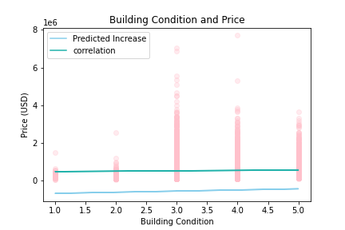
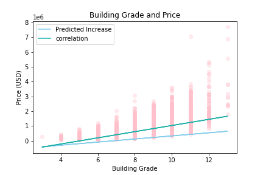

# How to increase house value via renovation

## Project Overview
In this project, I attmepted to answer following question: What kind of house renovations can home owners do to efficiently increase the predicted market price of their house?\
In order to answer this question, I have analysed data relating to houses in King County in order to investigate the relationshop between various feature of a house-like the size of the living space, the architecture, and the qaultiy of the material used to build the house- and the price of the house. Through the methods of multiple linear regression, I have isloated three features that significantly impact the price, namely the living area, building condition, and building grade.\
My three recommendations for home owners to maximize the predicted value of their houses through rennovations would be:\
**1. Try to increase living area by removing walls or adding rooms**\
**2. Make sure the facitlies are well-maintained to increase building condition**\
**3. Try to include custom designs or luxurious additions to the house to increase building grade**

### Business Problem
As briefly stated above, the goal of this project is to do research for a real estate agency that helps homeowners buy or sell homes, and to provide insight on what advice to give to homeowners regarding how home renovations might increase the estimated value of their homes, and by what amount.

### The Data

This project uses the King County House Sales dataset, which can be found in  `kc_house_data.csv` in the data folder of this GitHub repository. For the pruposes of this project, I decided to focus on select information that would be the most practical and useful for homeowners, such as the number of rooms, the area of the living space, and the classification for the house in terms of grade and conditon, as these are characteristics that could easily be altered via rennovating the house.

### Methods

The main tool used in this project is multiple linear regression, which takes in multiple independent variables and identifies how each one impacts the dependent varible, which is the price of the house in this scenario. The goal of doing so is to identify the top three variables that have the most significant impact on the price, and the extent to which they increase the price.\
Linear regression is appropriate for this analysis because it finds the average increase in price per unit increase of an independent variable, assuming the relationship between the variables are linear, which seems to be the case upon examination of the scatter matrix.\
To get to the model that best fits the data and thus has the highest predictive power, I used R squared- which measures the proportion of the variance of the dpenedent variable that is explained by the model-as a metirc to guage the fitness of the model, and I developed a simple baseline model to compare the more elaborate models to.
#### The Baseline Model
For the baseline model, I identified the variable that is the most strongly correlated to the price, whcih was squarefoot living area, and plotted a simple linear regression with just this variable. I obtained the R2 score by a 5-fold cross validation.\


Then, I divided the data into continuous variables and categorical variables. For the categorical variables, waterfront has binary values while the others (grade, condition, number of rooms) have multiple discrete numbers as values. I also observed that waterfront has null values. Upon close examination, I noticed the vast ,majority of the non-null values are 'NO', and decided to fill in the null values with the mode value for hihgher probability of accuracy without losing valuable indformation, which would happen if I were to drop the null rows.\
Moreover, I converted the rest of the categorical values into the dtype float, then fitted a multiple linear regression model to the data. Using the same cross validation method, I took note of the R2 score, which was higher than that of the baseline, indicating an improvement. Moreover, according to the OLS model, all the coefficients were statistically significant, meaning they are very likely correlated due to cause and effect instead of by chance.
I then log transformed and normalised the continuous data so that the residuals would be more normally distributed and the data distribution more homoscedastic to better fulfill the assumptions of linear regression, then ran a multiple linear regression with the transformed data, but the R2 score was signifcantly worse than that of the untransformed data, therefore I chose the previous model over this one.\
Then, I tried one-hot encoding the categorical variables instead of converting them into numberical data to see if the resulting model would yield a better R2 score, but it did not.\
Finally, I looked at the correlation coefficients of all the variables to see if there is any strong colinearity, defined as having the correlation coefficient higher than or equal to 0.75, but there were not, so no further modifying was needed in that regard.\
After experimenting with different models by transforming the data in various ways, I settled for the second model wih all the data as numerical values and untransformed, with an R2 score of 0.587.\
Using the untransformed data, I then used train-test split 5 times to run a linear regression model, and the coefficients and final R2 score was obtained from the avergae of the 5 results. This was done as opposed to using the OLS model, which uses all the data as input, in order to avoid overfitting. 

## Results
The OLS summary of the final model is as follows:

OLS Regression Results
Dep. Variable:	price	R-squared:	0.591
Model:	OLS	Adj. R-squared:	0.591
Method:	Least Squares	F-statistic:	3901.
Date:	Wed, 07 Dec 2022	Prob (F-statistic):	0.00
Time:	17:05:00	Log-Likelihood:	-2.9773e+05
No. Observations:	21597	AIC:	5.955e+05
Df Residuals:	21588	BIC:	5.956e+05
Df Model:	8		
Covariance Type:	nonrobust		
coef	std err	t	P>|t|	[0.025	0.975]
Intercept	-7.24e+05	1.76e+04	-41.090	0.000	-7.59e+05	-6.9e+05
cond_ind	5.931e+04	2564.940	23.123	0.000	5.43e+04	6.43e+04
grade_ind	1.061e+05	2272.473	46.677	0.000	1.02e+05	1.11e+05
bedrooms	-3.866e+04	2201.663	-17.557	0.000	-4.3e+04	-3.43e+04
bathrooms	-1.156e+04	3525.074	-3.280	0.001	-1.85e+04	-4653.839
floors	-2.062e+04	3634.665	-5.674	0.000	-2.77e+04	-1.35e+04
wtf_bin	8.186e+05	1.97e+04	41.579	0.000	7.8e+05	8.57e+05
sqft_living	209.0878	3.498	59.766	0.000	202.231	215.945
sqft_lot	-0.3323	0.039	-8.417	0.000	-0.410	-0.255
Omnibus:	15280.876	Durbin-Watson:	1.981
Prob(Omnibus):	0.000	Jarque-Bera (JB):	794926.842
Skew:	2.837	Prob(JB):	0.00
Kurtosis:	32.175	Cond. No.	5.43e+05


All the coefficients have p-values lower than 0.05, which indicates they are statistically significant.\
Moreover, the most significant variables were **building grade** , **building conditon**, and **squarefoot living**, their respective coefficient can be interpreted as:

**For every unit increase in building condition, the price increases by an average of 59472.8 dollars.**



**For every unit increase in building grade, the price increases by an average of 106323.2 dollars.**



**For every unit increase in squarefoot living area, the price increases by an average of 208.3 dollars.**


<p>Keeping this in mind, homeowners may aim to increase these variables accordingly to maximize the predicted value of their houses.</p>

### Conclusion

With these three coefficients in mind, the three recommendations one can give to home owners are the following.\
**1. improve building condition**\
Building condition has to do with the maintenance of the house,when doing renovations, aim to increasing the life expectancy of the hosue upgrading old or deteriorating structures.\
**2. improve building grade**\
Building grade is related to the architecture/ design of the house, both interior and exterior.This includes the aesthetic of the architecture, and the quality of the material used in the building.The basic requirement is to meet the building code, and the grade can be further increased by including custom designs and added amenities such as solid woods, bathroom fixtures, marble entry ways, wood trim, high quality cabinet work etc.\
**3. increase living area**\
Living area is the area of the house exlcuding the walls. When renovating, living area could be increased by removing walls or adding extra rooms.

### Caveats
According to the OLS model, the data has a significant degree of positive skewness and kurtosis, the former meaning the data is not normally distributed, with the median and mode higher than the mean, and the latter meaning there are many outliers that cannot be explained by the linear regression model.\
Moreover, the data violates the two assumptions of linear regression- homoscedasticity and normality, which negatively impacts the reliability of the predictions.\
The Next step would be to investigate the outliers of the data set to see why there is such high kurtosis and skewedness,
and potentially discover more confounding variables that would help the model make better predictions. A good place to start would be to include the variables that were disregarded in this project to see if they can explain the ouliers better.

### For More Information 
Please review our full analysis in [the github repository](./dsc-phase-2-project-v2-3) or my [presentation](./DS_Project2_Presentation.pdf).\
For any additional questions, please contact **Beatrix Wong, beatrix.wmh@hotmail.com**

## Repository Structure
```
├── README.md                           <- The top-level README for reviewers of this project
├── student.ipynb                       <- Narrative documentation of analysis in Jupyter notebook
├── DS_Project_Presentation.pdf         <- PDF version of project presentation
├── data                                <- Both sourced externally and generated from code
└── images (.png)                       <- Both sourced externally and generated from code
```